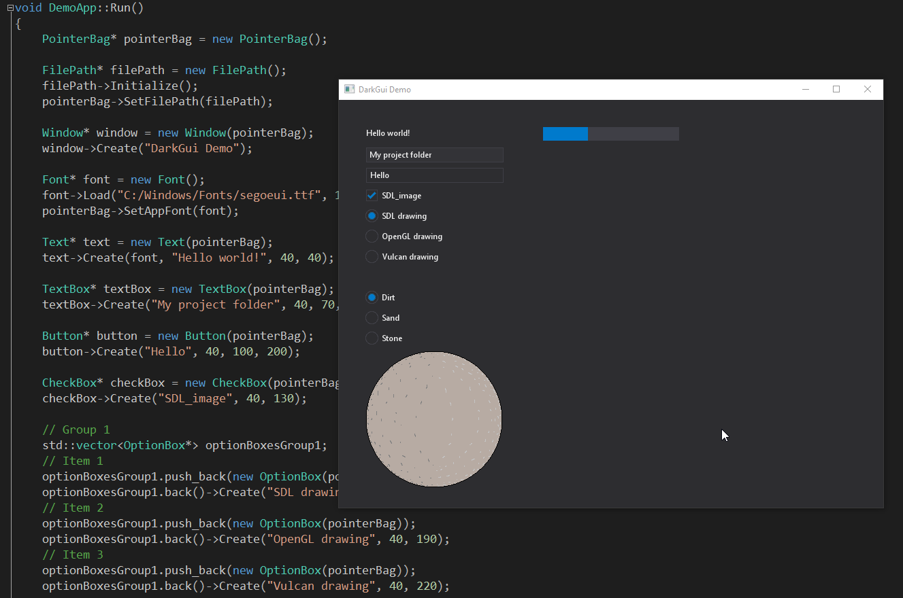

# DarkGui

I wanted to make an UI that was easy to use and with an inspiration of Windows dark flat UI. For dependency it uses the SDL2 library which works well for this project. My goal was to implement the most common UI controls so this could be used as a drop-in solution into other projects.

Tags: C++, UI
